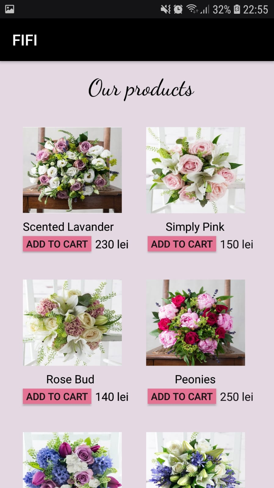
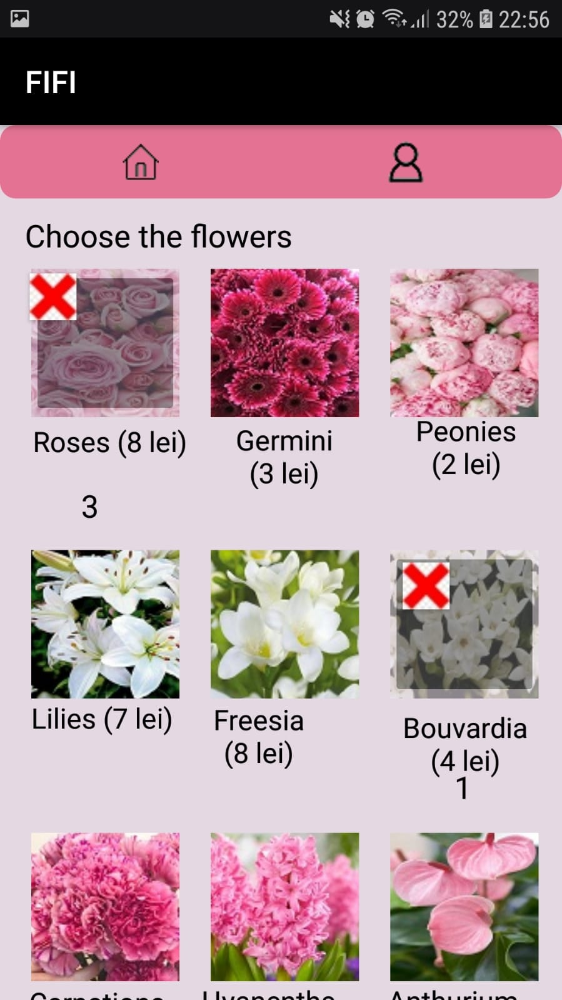
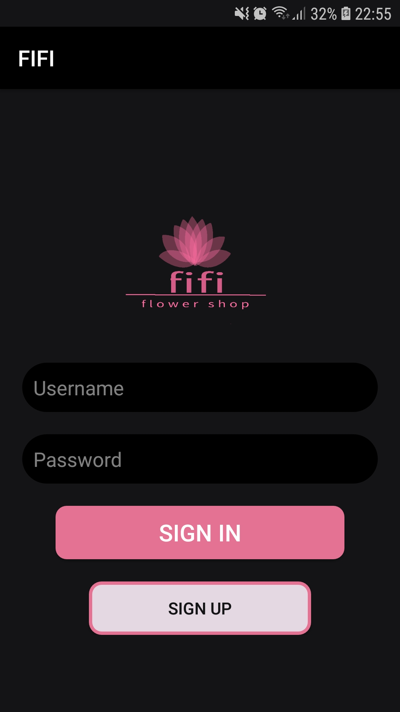
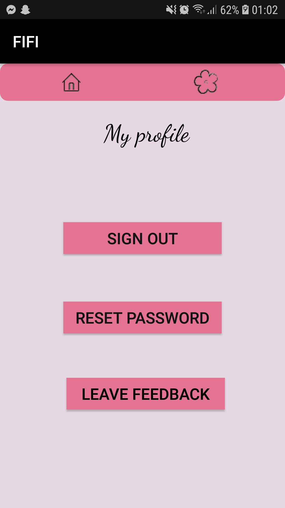
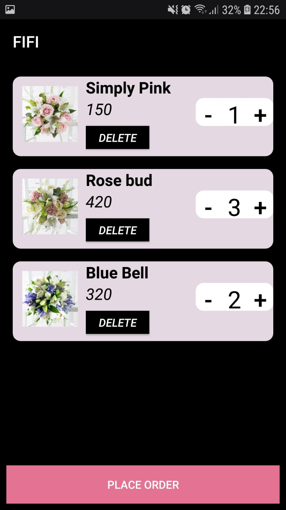
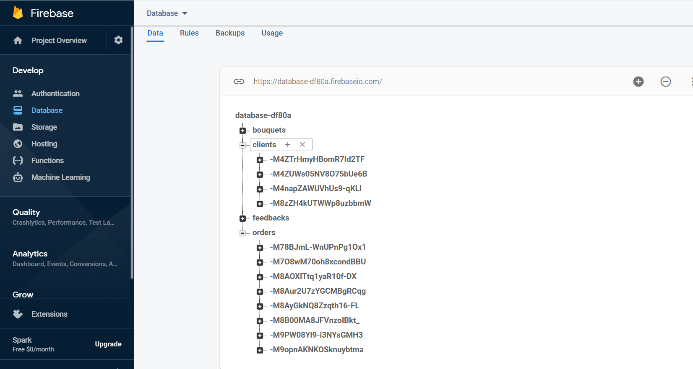

# Online Flower Shop App

Project for the Software Development Methods laboratory that consists in an Android application coded with Kotlin that represents an online flower shop with posibility to order predefined bouquets or to personalize one. 

First, the user must log in(enter the username and password) to see the features of the app. In case he doesn't have an account, he must create one.  

The user can change his password anytime and he also can leave a feedback.

The user can see the bouquets he chose in the shopping cart, change quantity and then place the order by completing a form.

All data(about clients, orders, feedbacks and bouquets) is stored in Firebase:

## Demo link: 
https://www.youtube.com/watch?v=K4xqZvCbMlc&feature=youtu.be
